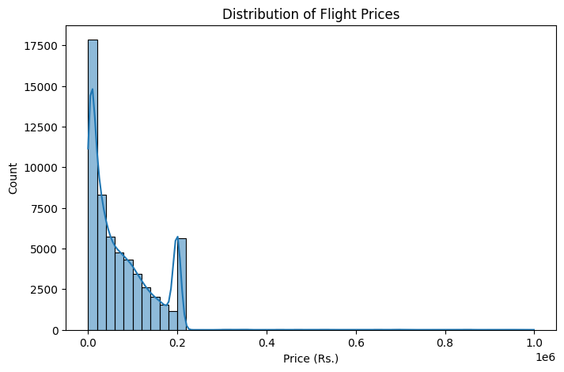
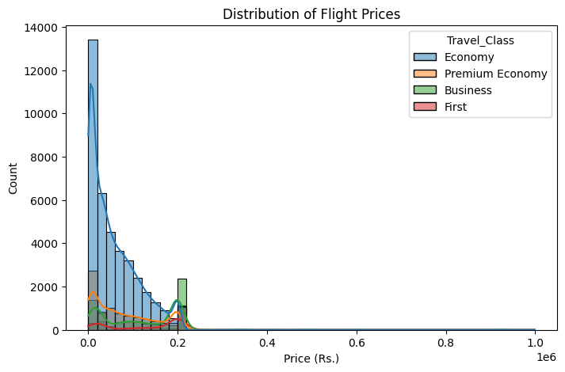
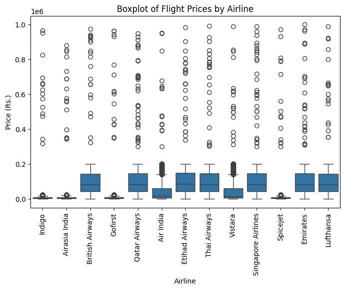
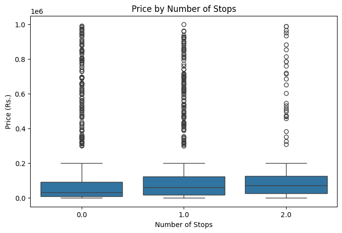
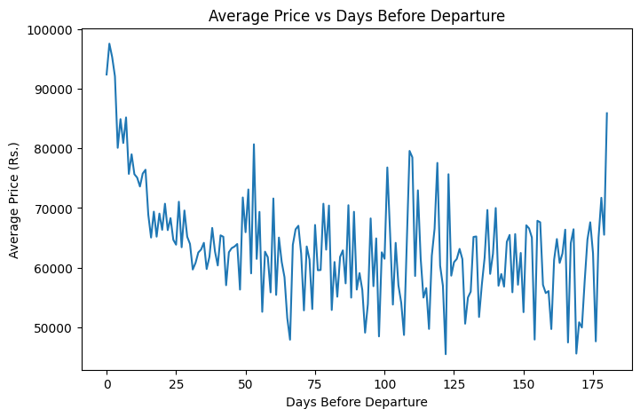
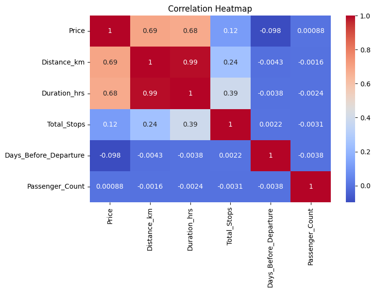
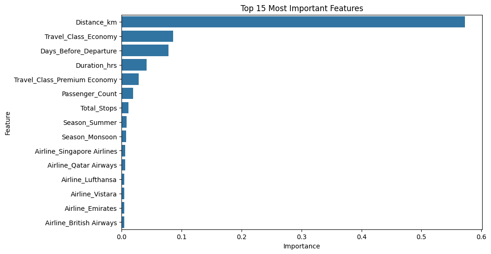

# AI Travel Analyst — Flight Price Prediction

## Project Overview

This is my submission for the MIC AIML Department Recruitment Challenge (Data Science & Visualization track). The goal was to dig into a flight pricing dataset, figure out what actually drives ticket prices, and build a model that can predict prices based on flight details.

I went with the flight pricing dataset provided for this challenge, and honestly, most of the real work here wasn't the modeling — it was the data cleaning. The dataset was intentionally messy (I'm guessing on purpose, to test how we handle real-world data), and untangling it taught me more than the modeling step did.

## Problem Statement

Flight prices depend on a bunch of factors — how far you're flying, which airline, what class, how early you book, how many stops — and it's not always obvious which of these actually matter and by how much. This project tries to answer that with data instead of guesswork, and then builds a regression model to predict prices based on what it learns.

## Installation Instructions

You'll need Python with these libraries:

```bash
pip install pandas numpy matplotlib seaborn scikit-learn
```

Then just open `flight_price_analysis.ipynb` in Jupyter Notebook or Google Colab and run the cells top to bottom. Everything is sequential — cleaning first, then visualization, then modeling — so running it in order matters.

## Dataset Used

`flight_pricing_dataset.csv` — 100,000 rows, 18 columns. Includes Airline, Source, Destination, Departure_Date, Duration, Total_Stops, Distance_km, Travel_Class, Days_Before_Departure, Season, Passenger_Count, and Price (the target).

## Methodology

### Data Cleaning

This dataset was genuinely messy, and not in one consistent way — each column had its own quirks:

- **Duration** mixed decimal hours (`1.67`) with text like `"0h 45m"` in the same column. I wrote a custom function to detect the format and convert everything into a single decimal-hours column (`Duration_hrs`), while keeping the original column untouched for reference.
- **Total_Stops** mixed numbers (`0`, `1`) with text (`"non-stop"`, `"1 stop"`). Mapped these to a consistent numeric scale.
- **Price** had currency prefixes and comma separators (`"Rs. 151,632.89"`). Stripped those out before converting to numeric.
- **Distance_km** had unit suffixes (`"10168.1 km"`) that needed removing.
- **Days_Before_Departure** had a `"days"` suffix in some entries.
- **Passenger_Count** had word-form numbers (`"two"`, `"four"`) mixed with digits.
- **Airline** had inconsistent capitalization — `"Indigo"`, `"indigo"`, and `"INDIGO"` were all being treated as different airlines until I standardized casing with `.str.title()`.

For missing values, I made a deliberate choice to drop incomplete rows rather than fill them in. Early on I actually tried filling missing values with 0, and quickly realized that was a bad idea — a ₹0 flight or a 0 km distance isn't a real value, it's a lie the model would've learned from. Since the dataset was large (100k rows) and missing values were only around 5% per column, dropping was the safer, more honest option. Ended up keeping 57,615 of the original 100,000 rows (57.6%).

### Exploratory Data Analysis

Built five visualizations to understand what's driving prices:

1. **Price distribution** — turned out to be bimodal, which I didn't expect going in
2. **Price by Airline** — boxplot comparing carriers
3. **Price by Total Stops** — boxplot
4. **Price vs Days Before Departure** — scatter plot, plus an aggregated average-price line since the raw scatter was too dense with 57k points to read
5. **Correlation heatmap** — numeric features against Price

### Feature Engineering

One-hot encoded the categorical columns (Airline, Source, Destination, Travel_Class, Season) using `pd.get_dummies`, which expanded the feature set from 10 columns to 129.

### Modeling

Used a Random Forest Regressor (100 trees), trained on an 80/20 split (`random_state=42` for reproducibility). Went with Random Forest over something simpler like Linear Regression because it handles a mix of numeric and one-hot encoded categorical features well without needing much extra preprocessing, and it gives you feature importance for free, which mattered for this task.

## Technologies Used

- Python
- pandas, numpy
- matplotlib, seaborn
- scikit-learn (RandomForestRegressor)
- Google Colab

## Results

### What actually drives flight prices

- **Distance_km and Duration_hrs** are the strongest numeric drivers — correlation of about 0.69 and 0.68 with Price. Makes sense, and the two are almost perfectly correlated with each other (0.99), so they're really telling the same story: longer routes cost more.
- **Travel_Class** turned out to be a bigger deal than I expected. The price distribution chart showed a clear second cluster around ₹2,00,000, and digging into it, that's almost entirely Business class fares. Economy, Premium Economy, and First all cluster much lower and closer together — Business stands apart on its own.
- **Days_Before_Departure** has a weak linear correlation (-0.098), which on its own looks unimportant. But plotting average price against booking day revealed a real pattern the correlation number completely missed: prices spike hard for anything booked within about 15 days of departure, then flatten out and stay fairly stable from 3 weeks out all the way to 6 months out. Correlation only catches straight-line relationships, so this was a good reminder not to rely on it alone.
- **Total_Stops** has a weak positive correlation (0.12) — more stops tends to mean slightly higher prices, which is a bit counterintuitive. My guess is this isn't stops causing the price increase directly, but that longer international routes both have more stops and cost more, so the two are just riding along together.
- **Airline** matters too — international carriers (Emirates, Qatar Airways, Singapore Airlines) run noticeably higher than budget domestic ones (IndiGo, SpiceJet).
- **Passenger_Count** had basically zero effect (correlation ~0.00088), which makes sense since this is price per ticket, not per booking.

### Model performance

- **MAE:** ₹13,854.19
- **RMSE:** ₹46,375.40
- **R² Score:** 0.62

The model explains about 62% of the variation in prices. The fairly large gap between MAE and RMSE is worth calling out — it means most predictions are reasonably close, but a smaller number are way off, and those big misses are dragging RMSE up disproportionately (RMSE punishes large errors much more than MAE does). My working theory is this comes back to the Business-class cluster — those fares are harder for the model to pin down precisely since they behave so differently from the rest of the data.

Feature importance from the trained model backed up the correlation analysis — Distance_km, Duration_hrs, and the Travel_Class encodings came out on top, which was a nice sanity check that the model actually learned what the EDA suggested it should.

## Challenges Faced

- The messiness of the dataset was the biggest time sink, and it wasn't a single fix — every numeric column had its own specific formatting problem, so I had to go column by column instead of writing one generic cleaning function.
- I made a genuine mistake early on filling missing values with 0, which silently corrupted Price, Distance, and Passenger_Count with fake values. Caught it by noticing the numbers didn't make sense, reloaded the raw data, and switched to dropping incomplete rows instead. Left this in as a challenge because I think it's a useful thing to have caught rather than something to hide.
- Getting `pd.to_numeric` to behave required understanding the difference between `errors='raise'` (the default, crashes on bad values) and `errors='coerce'` (converts anything unparseable to NaN instead) — small detail, but it broke my cleaning pipeline more than once before I got it right.
- The bimodal price distribution makes this a genuinely harder prediction problem than a single smooth distribution would be, which shows up directly in the RMSE.

## Future Improvements

- Try training separate models per Travel_Class, or adding interaction features, to specifically target the Business-class prediction gap
- Compare against other models (Gradient Boosting, XGBoost) to see if the R² improves
- Hyperparameter tuning with GridSearchCV instead of default RandomForest settings
- Look into why First class doesn't show the same separate price cluster that Business does — that was an unexpected asymmetry I didn't have time to fully chase down

## Screenshots








